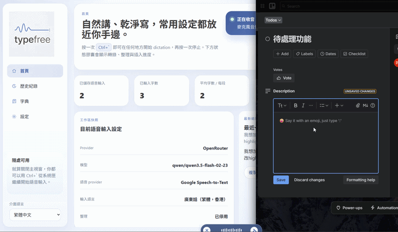

# TypeFree

繁體中文：TypeFree 是一個目前以 Windows 為目標的桌面語音輸入工具，使用 Google Speech-to-Text 做語音轉文字，並可配合 OpenRouter 或 Ollama 做輕量文字整理，同時支援自訂快捷鍵、系統匣常駐、overlay 狀態提示與本地歷史紀錄。  
English: TypeFree is a Windows-focused desktop dictation tool that uses Google Speech-to-Text for transcription and can pair with OpenRouter or Ollama for light transcript cleanup, with customizable shortcuts, tray support, overlay status feedback, and local history.

## Demo / 示範影片



## Download / 下載

繁體中文：你可以直接從 GitHub Releases 下載最新版本。  
English: You can download the latest build directly from GitHub Releases.

- [Latest release page](https://github.com/1mins-ai/typefree/releases/latest)
- [Latest Windows MSI](https://github.com/1mins-ai/typefree/releases/latest/download/TypeFree_0.1.0_x64_en-US.msi)

## 1. Project Intro / 專案簡介

繁體中文：這個 project 以「可自己掌控成本與工作流程」為方向，提供一個可以在桌面任何位置觸發的 dictation app。你可以用全域快捷鍵開始或停止錄音，讓 app 把語音送去 Google Speech-to-Text 轉錄，再視乎設定交由 OpenRouter 或本地 Ollama 做簡單整理，最後把文字插入到目前焦點所在的輸入位置。  
English: This project is built around controllable cost and workflow flexibility. It provides a desktop dictation app that can be triggered from anywhere with a global shortcut, sends audio to Google Speech-to-Text, optionally cleans the transcript with OpenRouter or local Ollama, and then inserts the text into the currently focused input target.

## 2. Why This Project Exists / 為什麼會做這個 Project

繁體中文：開發 TypeFree 的原意，是因為像 Typeless 這類產品如果按月訂閱使用，成本可能會去到每月約 USD 30。對某些人來說，這種固定月費模式未必最適合。TypeFree 想提供另一種思路：把語音辨識與文字整理拆成可以自行選擇的 provider，改用 pay-as-you-go 或本地模型的方式，讓成本結構更可控，同時保留自行客製 shortcut、model 同 workflow 的空間。  
English: TypeFree was created because products such as Typeless can cost around USD 30 per month on a subscription basis. For some people, that fixed monthly model is not the best fit. TypeFree explores a different approach: separate speech recognition and text cleanup into user-selectable providers, rely on pay-as-you-go services or local models, and keep room for custom shortcuts, models, and workflows.

## 3. Features / 主要功能

繁體中文：

- 以全域快捷鍵開始與停止 dictation
- 使用 Google Speech-to-Text 做語音轉錄
- 使用 OpenRouter 或 Ollama 做 transcript cleanup
- 提供系統匣常駐與主視窗顯示/隱藏
- 提供 overlay 狀態提示，顯示 listening / transcribing / cleaning 等階段
- 支援開機自啟
- 保留本地 dictation 歷史紀錄
- 支援常用詞 / phrase hints，幫助 Google Speech 更容易辨識特定字詞

English:

- Start and stop dictation with a global shortcut
- Use Google Speech-to-Text for speech transcription
- Use OpenRouter or Ollama for transcript cleanup
- Run in the system tray and show or hide the main window
- Show overlay status feedback for states like listening, transcribing, and cleaning
- Support launch on startup
- Keep local dictation history
- Support common words and phrase hints to improve recognition for specific terms

## 4. Windows-Only Status / 目前只支援 Windows

繁體中文：目前這個 project 只支援 Windows。現時的桌面 release 流程、tray 行為、global shortcut 體驗，以及文字插入相關流程，都是以 Windows 使用情境作為主要目標來設計與測試。README 不會假設 macOS 或 Linux 已經可正式使用。  
English: This project currently supports Windows only. The current desktop release flow, tray behavior, global shortcut experience, and text insertion flow are designed and tested primarily for Windows usage. This README does not assume macOS or Linux are production-ready.

## 5. Requirements / 環境需求

繁體中文：

- Node.js 與 npm
- Rust toolchain
- Windows 上可用的 Tauri build 環境
- 可連線到 Google Speech-to-Text 的網路環境
- 如要使用 OpenRouter cleanup，需要 OpenRouter API key
- 如要使用 Ollama cleanup，需要本機可用的 Ollama instance 與 model

繁體中文補充：由於這個 repo 使用 Tauri 2，請先準備好 Windows 上 Tauri 所需的原生依賴與編譯工具鏈，再進行 build。這份 README 不會把未經驗證的版本號寫死。  
English:

- Node.js and npm
- Rust toolchain
- A working Tauri build environment on Windows
- Network access for Google Speech-to-Text
- An OpenRouter API key if you want OpenRouter cleanup
- A local Ollama instance and model if you want Ollama cleanup

English note: This repo uses Tauri 2, so make sure the native Windows dependencies and toolchain required by Tauri are installed before building. This README intentionally avoids hard-coding unverified version numbers.

## 6. Build From Source / 本地 Build

繁體中文：先安裝 npm dependencies。  
English: Install the npm dependencies first.

```bash
npm install
```

繁體中文：如果只想先做前端 build，可以使用以下指令。這會執行 TypeScript compile 再做 Vite build。  
English: If you only want to build the frontend, use the following command. It runs the TypeScript compile step and then the Vite build.

```bash
npm run build
```

繁體中文：如果你想在本機以桌面 app 方式開發與測試，請使用 Tauri dev。  
English: If you want to develop and test the desktop app locally, use Tauri dev.

```bash
npm run tauri dev
```

繁體中文：這個 repo 目前在 `package.json` 內提供的 script 主要是 `dev`、`build`、`preview` 同 `tauri`。因此桌面 app 的開發與 release 打包都會透過 `npm run tauri ...` 進行。  
English: The scripts currently exposed in `package.json` are `dev`, `build`, `preview`, and `tauri`. That means desktop development and release packaging are both driven through `npm run tauri ...`.

## 7. Create Release EXE / 製作 Release EXE

繁體中文：要建立正式 release 版本，請執行以下指令。  
English: To create a production release build, run:

```bash
npm run tauri build
```

繁體中文：Tauri 會先執行 `beforeBuildCommand`，即 `npm run build`，然後再進行桌面 bundle。產物會放在 `src-tauri/target/release/bundle/`。在 Windows 下，安裝程式 `.exe` 會以 `nsis/` 子目錄為主；如果同時產生 `.msi`，可視為額外的安裝格式。  
English: Tauri will first run the `beforeBuildCommand`, which is `npm run build`, and then create the desktop bundles. The output is placed under `src-tauri/target/release/bundle/`. On Windows, the installer `.exe` is expected under the `nsis/` subdirectory; if a `.msi` is also generated, treat it as an additional packaging format.

繁體中文：如果你只想找 Windows release installer，通常先看這個位置：`src-tauri/target/release/bundle/nsis/`。  
English: If you only need the Windows release installer, the first place to check is usually `src-tauri/target/release/bundle/nsis/`.

## 8. Initial Setup / 首次設定

繁體中文：第一次使用前，至少需要完成以下設定：

- 填入 Google Speech API key
- 選擇 transcript cleanup provider：OpenRouter 或 Ollama
- 如果使用 OpenRouter，填入 OpenRouter API key 與 model
- 如果使用 Ollama，填入 Ollama base URL 與 model
- 確認 source language，預設為 `yue-Hant-HK`
- 按需要設定 global hotkey、history retention、launch on startup

繁體中文：如果你想跟住一步一步去 Google Cloud Platform 建立 Speech-to-Text API key，以及建立 OpenRouter API key，可以直接參考 [docs/api-key-setup.md](./docs/api-key-setup.md)。

繁體中文補充：

- Google Speech 是目前唯一支援的 speech provider
- 預設 source language 是粵語（繁體，香港）`yue-Hant-HK`
- 若 Google API key 未填，speech transcription 會失敗
- 若 OpenRouter API key 或 model 未填，而你又選用了 OpenRouter cleanup，cleanup 會失敗
- 若 Ollama base URL 或 model 未填，而你又選用了 Ollama cleanup，cleanup 會失敗
- 你可以透過 common words / dictionary / phrase hints 增加常用字詞，提高特定術語的辨識機會

English: Before first use, you should at least configure the following:

- Enter a Google Speech API key
- Choose a transcript cleanup provider: OpenRouter or Ollama
- If using OpenRouter, enter an OpenRouter API key and model
- If using Ollama, enter an Ollama base URL and model
- Confirm the source language, which defaults to `yue-Hant-HK`
- Configure the global hotkey, history retention, and launch-on-startup behavior if needed

English: If you want a step-by-step guide for creating a Google Cloud Speech-to-Text API key and an OpenRouter API key, see [docs/api-key-setup.md](./docs/api-key-setup.md).

English notes:

- Google Speech is currently the only supported speech provider
- The default source language is Cantonese (Traditional, Hong Kong), `yue-Hant-HK`
- If the Google API key is missing, speech transcription will fail
- If the OpenRouter API key or model is missing while OpenRouter cleanup is selected, cleanup will fail
- If the Ollama base URL or model is missing while Ollama cleanup is selected, cleanup will fail
- You can use common words, dictionary entries, and phrase hints to improve recognition for repeated terms

## 9. Cost Model / 成本模式

繁體中文：TypeFree 並不是「零成本」方案，而是把成本轉成更細緻、可調整的形式。實際費用會取決於你使用多少 Google Speech-to-Text、是否啟用 OpenRouter，以及你是否改用本地 Ollama model。相比固定月費產品，這種模式未必對所有人都更便宜，但對某些使用情境會更容易控制支出，也更容易按自己的需要調整。  
English: TypeFree is not a zero-cost solution. Instead, it shifts cost into a more granular and adjustable structure. Your actual expense depends on how much Google Speech-to-Text you use, whether you enable OpenRouter, and whether you switch to a local Ollama model. Compared with fixed subscription products, this model is not guaranteed to be cheaper for everyone, but it can be more controllable for some usage patterns.

## 10. Customization / 可自訂性

繁體中文：自訂能力係呢個 project 嘅核心價值之一。你可以按自己習慣設定 global hotkey、選擇 transcript cleanup provider、切換 model、調整 source language、加入常用詞，以及決定歷史紀錄保留方式。如果你想整一個更貼近自己工作流嘅 dictation app，而唔係完全跟隨預設產品設計，TypeFree 就係朝住呢個方向去做。  
English: Customization is one of the core values of this project. You can tune the global hotkey, choose the transcript cleanup provider, switch models, adjust the source language, add common words, and decide how long history should be retained. If you want a dictation app that fits your own workflow instead of being locked into a single default product design, TypeFree is built in that direction.

## 11. License / 授權

繁體中文：本 project 以 MIT License 發佈。詳情請參考 [LICENSE](./LICENSE)。  
English: This project is released under the MIT License. See [LICENSE](./LICENSE) for details.
